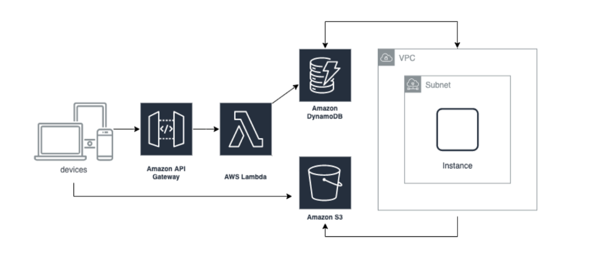
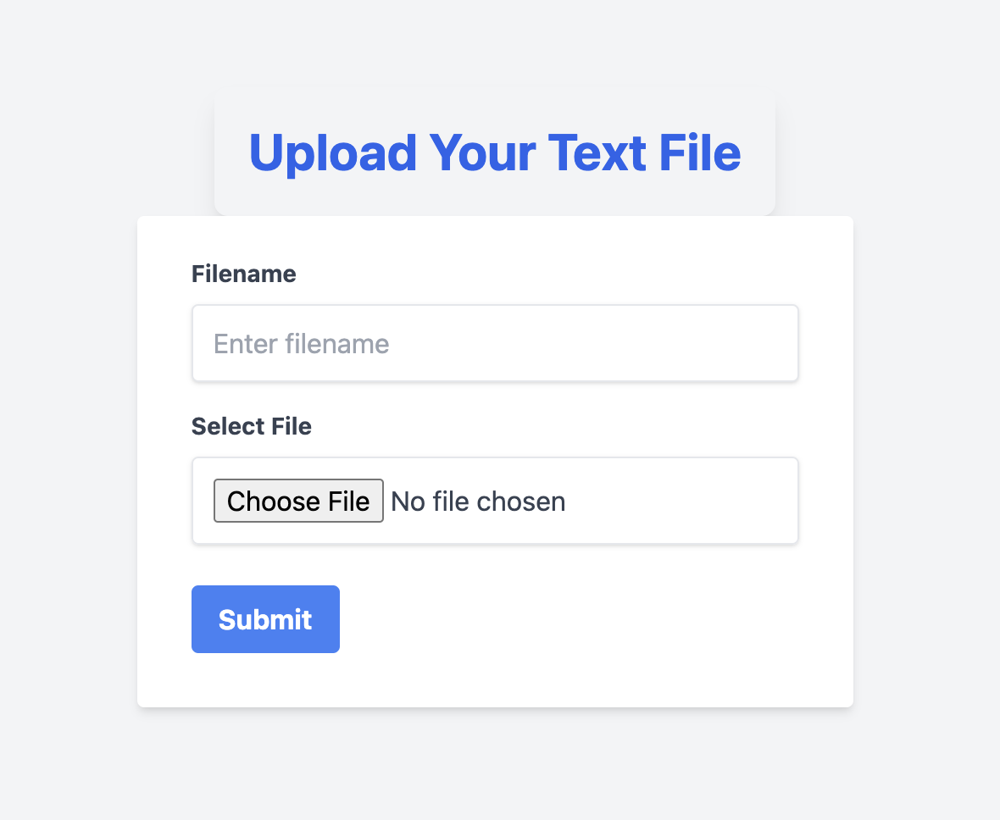

# AWS-simple-Fullstack
This is Simple Full Stack project using AWS resources. Frontend takes a file from user and uploads it to S3 and triggers a Lambda function to do some async proccessing on the input file and update results in a DynomoDB


## Project Architecture

- **Frontend**: A responsive built with React and tailwind. It provides a user interface for uploading text files. When a file is uploaded, it directly uploads to an Amazon S3 bucket using a preSigned URL.
  
- **Amazon S3 Bucket**: Serves as the storage location for the uploaded files. And also for the processed Output Files.

- **AWS Lambda Function**: It is invoked by UI upon new file uploads. The function updates the user information in DynamoDB

- **Amazon DynamoDB**: A  NoSQL database service that stores the fileName, Input File location in S3 and also after processingn the location of output file in S3

- **AWS CDK (Cloud Development Kit)**: Used to define the cloud resources in code and provision them through AWS CloudFormation. This includes the S3 bucket, Lambda function, and DynamoDB table, API gateway.



## Installation

Before you begin, make sure you have Node.js, AWS CLI, and AWS CDK installed on your machine. Then, configure the AWS CLI with your credentials.

### Prerequisites

1. **Node.js**: Download and install Node.js (including npm) from [nodejs.org](https://nodejs.org/).

2. **AWS CLI**: Install the AWS Command Line Interface (CLI) following the instructions on the [AWS CLI user guide](https://docs.aws.amazon.com/cli/latest/userguide/cli-chap-install.html). After installation, configure it with your credentials using `aws configure`.

3. **AWS CDK**: Install the AWS Cloud Development Kit (CDK) globally using npm:

    ```bash
    npm install -g aws-cdk
    ```

### Setting Up the Project

1. **Clone the Repository**:

    Clone this repository to your local machine.

    ```bash
    git clone https://github.com/sivamunaganuru/AWS-simple-Fullstack
    ```

2. **Frontend Setup**:

    Navigate to the frontend directory and install dependencies.

    ```bash
    cd frontend
    npm install
    ```

3. **Backend Setup**:

    Navigate to the backend directory, install dependencies, and build the project.

    ```bash
    cd ../backend
    npm install
    npm run build && cdk synth
    ```

    If you encounter a "module not found" error during the build process, it's likely due to missing node modules in one of the lambda function directories. Navigate into each lambda directory, initialize npm, and install any necessary packages.

    ```bash
    cd lambda/ec2Trigger
    npm init -y
    npm install <missing-package>
    ```

4. **Deploy the Backend**:
    once the build and synth is succefull
    From the backend directory, deploy your infrastructure to AWS using CDK.

    ```bash
    cdk deploy BackendStack
    ```
    Once the deployement is succefull, **copy the Api gateway URL from console and update the VITE_API_URL = "your backend URL" in the .env file of frontend directory**

### Usage

After deploying the backend, start the frontend application. 

```bash
cd ../frontend
npm run dev
```

This will launch the application in your browser, where you can upload files. Uploaded files are processed by the backend infrastructure, and results are stored in DynamoDB.

Note : By default it will run in the us-west-1 (this can be changed in backend/lib/backend-stack.ts)

## Results

The flow of the project from file upload to processing and final data update—is demonstrated through a video available in the `assets` folder. 
Here's a broder breakdown:

1. **Initial State**: The DynamoDB table, S3 bucket, and EC2 instances start in an empty state, indicating no previous uploads or processing.

2. **File Upload via UI**: Files are uploaded through the user interface. This triggers direct uploads to the designated S3 bucket.

3. **Final State**:
    - The S3 bucket contains the uploaded files.
    - The DynamoDB table holds records of the processing results.
    - All EC2 instances are terminated.

### Video Demonstration


### User Interface Snapshot

Here is a snapshot of the user interface from which files are uploaded. This UI is part of the frontend application built for this project:



---


